# 🚀 PadFinder  

**PadFinder** is a mobile app built with **Expo** and **React Native** that allows users to explore SpaceX launches, view launch details, explore launchpads, and manage their favourite missions. It provides a themed UI, offline storage for favourites, and smooth navigation using **Expo Router**.  

---

## ✨ Features  

- **Search & Filter** – Search launches by name and sort by date.  
- **Launch Details** – View detailed info about any launch including failures, images, and date.  
- **Launchpad Screen** – See launchpad locations on an embedded Google Maps iframe and calculate distance from your location.  
- **Favourites** – Save launches as favourites and access them anytime.  
- **Themed UI** – Custom theme system with dark/light modes, styled components, and variant-based theming.  
- **Persistent State** – Offline persistence using Zustand storage.  
- **Fallback Assets** – Default illustrations for missing launch images and "No Results" screens.  

---

## ⚙️ Local Setup  

1. Clone the repo:  
   ```bash
   git clone https://github.com/your-username/padfinder.git
   cd padfinder
   ```

2. Install dependencies:  
   ```bash
   npm install
   # or
   yarn install
   ```

3. Run the app:  
   ```bash
   npx expo start
   ```

4. Build for production (Expo prebuild required):  
   ```bash
   expo prebuild
   ```

   > ⚠️ **Why Prebuild?**  
   Some dependencies (like `expo-location` and `react-native-webview`) require **native configuration**, which Expo Go does not support out of the box. That’s why you cannot simply use Expo Go to run this project—you need to **prebuild** to generate native iOS/Android projects.  

---

## 🤝 Contribution Guide  

We welcome contributions!  

1. Fork the repository.  
2. Create a feature branch:  
   ```bash
   git checkout -b feature/awesome-feature
   ```
3. Commit changes:  
   ```bash
   git commit -m "Add awesome feature"
   ```
4. Push branch and create a PR.  

Please follow the existing **code style** (Themed components, Zustand for state, Expo Router conventions).  

---

## 📂 File Structure  

Here’s a high-level structure of the project:

```mermaid
%%{init: {'theme':'default'}}%%
graph TD
  A[app] --> B((first_time))
  A --> C((individual))
  A --> D((tabs))
  A --> E[_layout.tsx]
  A --> F[+not-found.tsx]

  B --> B1[_layout.tsx]
  B --> B2[index.tsx]

  C --> C1[_layout.tsx]
  C --> C2[launchDetails.tsx]
  C --> C3[launchpad.tsx]

  D --> D1[_layout.tsx]
  D --> D2[favourite.tsx]
  D --> D3[index.tsx]

  G[assets] --> G1[fonts]
  G --> G2[images]

  H[components] --> H1[Loader]
  H --> H2[Themed]
  H --> H3[ThemedButton]
  H --> H4[ThemedCard]

  I[constants] --> I1[Colors.ts]

  J[services] --> J1[LaunchService.ts]
  J --> J2[LaunchpadService.ts]

  K[store] --> K1[spaceXStore.ts]
  K --> K2[variantStore.ts]

  L[types] --> L1[LaunchServiceTypes.ts]
  L --> L2[LaunchpadServiceTypes.ts]
```



---

## 🖼 Screenshots   

-   
-   
-   
-   
-   

---

## 🏁 Conclusion  

PadFinder is a modern React Native + Expo project showcasing **API integration, offline storage, theming, and native features** like location permissions. It’s designed as a learning playground and can be extended into a full-fledged space exploration companion app.  
